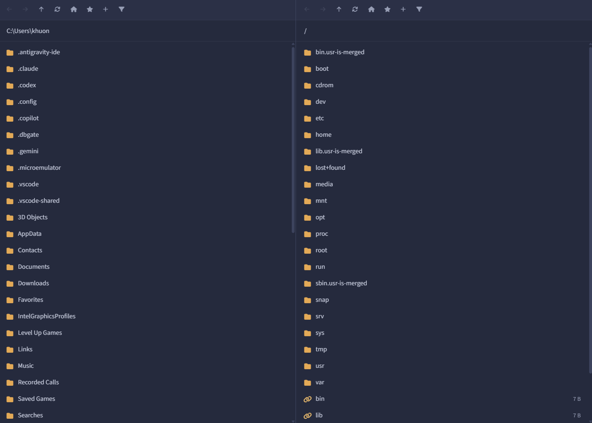
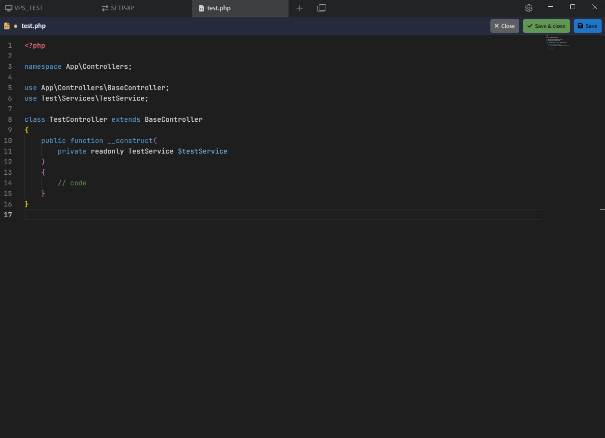
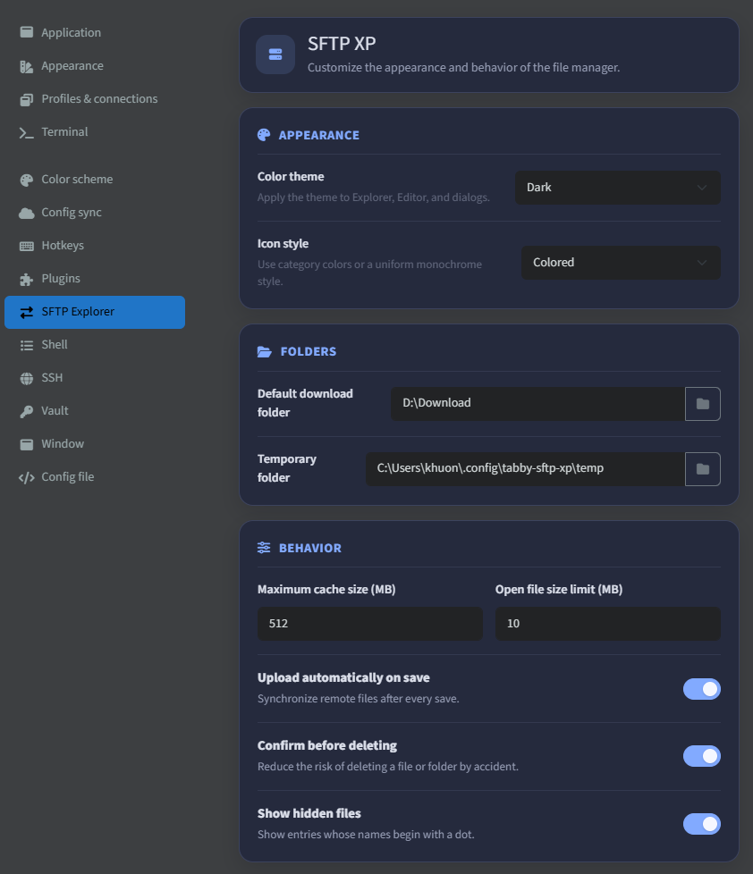

# Tabby SFTP XP

Manage local and remote files over SFTP, and edit remote files directly inside [Tabby](https://tabby.sh).

## Usage

1. Open an SSH profile in Tabby and wait for the connection to be established.
2. Click **SFTP-XP** in the SSH tab toolbar. A new explorer tab opens using the current SSH connection.
3. Use the left pane for local files and the right pane for files on the remote server.

### Browse files

- Double-click a folder to open it.
- Click the current path to enter another path, then press <kbd>Enter</kbd>.
- Use the toolbar to go back, forward, up one level, return home, refresh the directory, filter entries, or manage bookmarks.
- Right-click a file, folder, or empty area to see the available actions.

### Manage and transfer files

- Create, rename, delete, copy, and cut files or folders from the context menu.
- Copy or cut an item in either pane, then paste it into a local or remote directory.
- View file properties, edit POSIX permissions, or copy an item's full path from its context menu.

You can also use <kbd>Ctrl</kbd> + <kbd>C</kbd>, <kbd>Ctrl</kbd> + <kbd>X</kbd>, <kbd>Ctrl</kbd> + <kbd>V</kbd>, and <kbd>Delete</kbd> after selecting an item.

### Edit a remote file

1. Double-click a remote file, or right-click it and select **Edit**.
2. Make your changes in the built-in editor.
3. Click **Save**, **Save & close**, or press <kbd>Ctrl</kbd> + <kbd>S</kbd> to upload the changes to the server.

### Customize the plugin

Open **Settings → SFTP Explorer** in Tabby to configure the theme, icon style, download and temporary folders, cache and file-size limits, automatic uploads, delete confirmations, and hidden files.

## Preview

### SFTP Explorer

### File editor

### Settings

