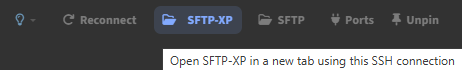
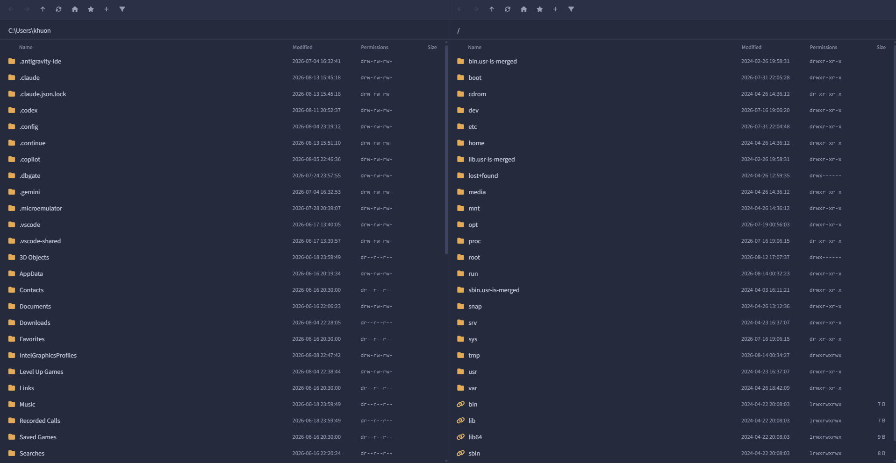
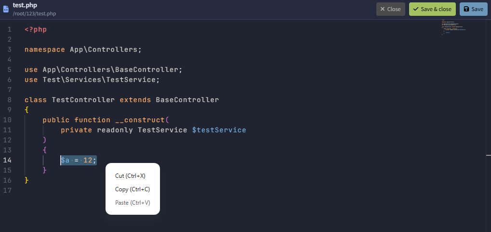
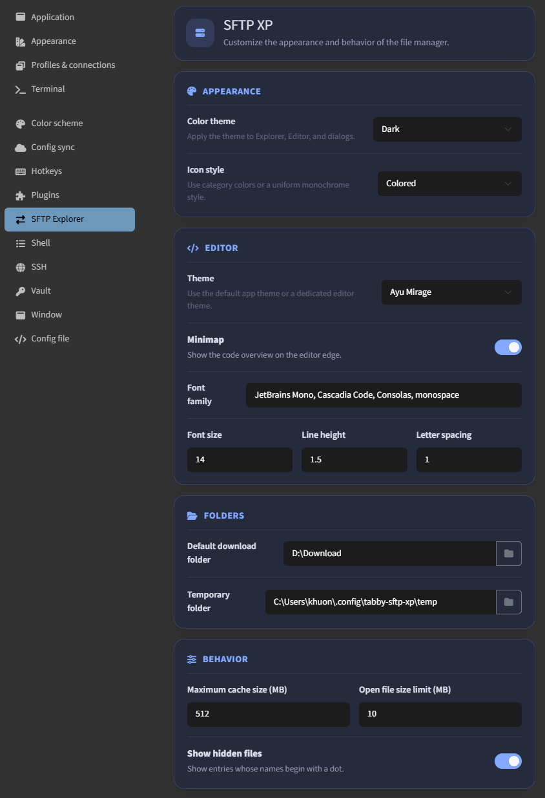

# Tabby SFTP XP

Manage local and remote files over SFTP, and edit remote files directly inside [Tabby](https://tabby.sh).

## Features

- Browse local and remote files side by side using an existing Tabby SSH connection.
- View file size, last-modified time, and symbolic POSIX permissions such as `-rw-r--r--`.
- Select multiple files and folders with <kbd>Ctrl</kbd>/<kbd>Shift</kbd> + click or by dragging a selection box.
- Create, rename, delete, copy, cut, paste, transfer, and bookmark files and folders, including whole multi-item selections.
- Drag and drop one file, folder, or an entire selection between the local and remote panes to upload or download it.
- Edit local and remote files in a built-in Monaco editor with immediate upload on save.
- Use the system clipboard to copy and paste between the editor and other applications.
- Customize the explorer appearance and editor typography, minimap, and color theme.

## Usage

1. Open an SSH profile in Tabby and wait for the connection to be established.
2. Click **SFTP-XP** in the SSH tab toolbar. A new explorer tab opens using the current SSH connection.
3. Use the left pane for local files and the right pane for files on the remote server.

### Browse files

- Double-click a folder to open it.
- Click the current path to enter another path, then press <kbd>Enter</kbd>.
- Use the toolbar to go back, forward, up one level, return home, refresh the directory, filter entries, or manage bookmarks.
- Review each item's modified time, symbolic POSIX permissions, and size. Metadata columns hide automatically when a panel becomes narrow so names remain readable.
- Right-click a file, folder, or empty area to see the available actions.

### Manage and transfer files

- Select multiple items with <kbd>Ctrl</kbd>/<kbd>Shift</kbd> + click, or drag a selection box starting from empty space in the file list.
- Create, rename, delete, copy, and cut files or folders from the context menu; copy, cut, and delete act on the whole selection.
- Copy or cut an item (or a selection) in either pane, then paste it into a local or remote directory.
- Drag a file, folder, or a multi-item selection from one pane and drop it onto the other to upload or download it; drop it onto a specific folder row to transfer directly into that folder. The destination directory refreshes automatically once the transfer finishes, and the drop is rejected if the destination isn't writable.
- View file properties, edit POSIX permissions, or copy an item's full path from its context menu.
- Deletion always asks for confirmation before removing an item or selection.

You can also use <kbd>Ctrl</kbd> + <kbd>C</kbd>, <kbd>Ctrl</kbd> + <kbd>X</kbd>, <kbd>Ctrl</kbd> + <kbd>V</kbd>, and <kbd>Delete</kbd> after selecting an item or a multi-item selection.

### Edit a remote file

1. Double-click a remote file, or right-click it and select **Edit**.
2. Make your changes in the built-in editor.
3. Click **Save**, **Save & close**, or press <kbd>Ctrl</kbd> + <kbd>S</kbd> to upload the changes to the server.

The editor shows the full remote path below the filename. Its Cut, Copy, and Paste commands use the system clipboard, so text can move between Monaco and other applications. Remote files are uploaded immediately on every save.

### Customize the plugin

Open **Settings → SFTP Explorer** in Tabby to configure:

- Explorer color theme, icon style, folders, cache limits, file-size limits, and hidden files.
- Editor theme: Default, Dracula, Tokyo Night, Ayu Dark, Ayu Mirage, One Dark Pro, Monokai, or Nord.
- Editor minimap, font family, font size, line height, and letter spacing.

See [CHANGELOG.md](CHANGELOG.md) for release details.

## Preview

### SFTP-XP button in the SSH tab toolbar

### SFTP Explorer

### File editor

### Settings

